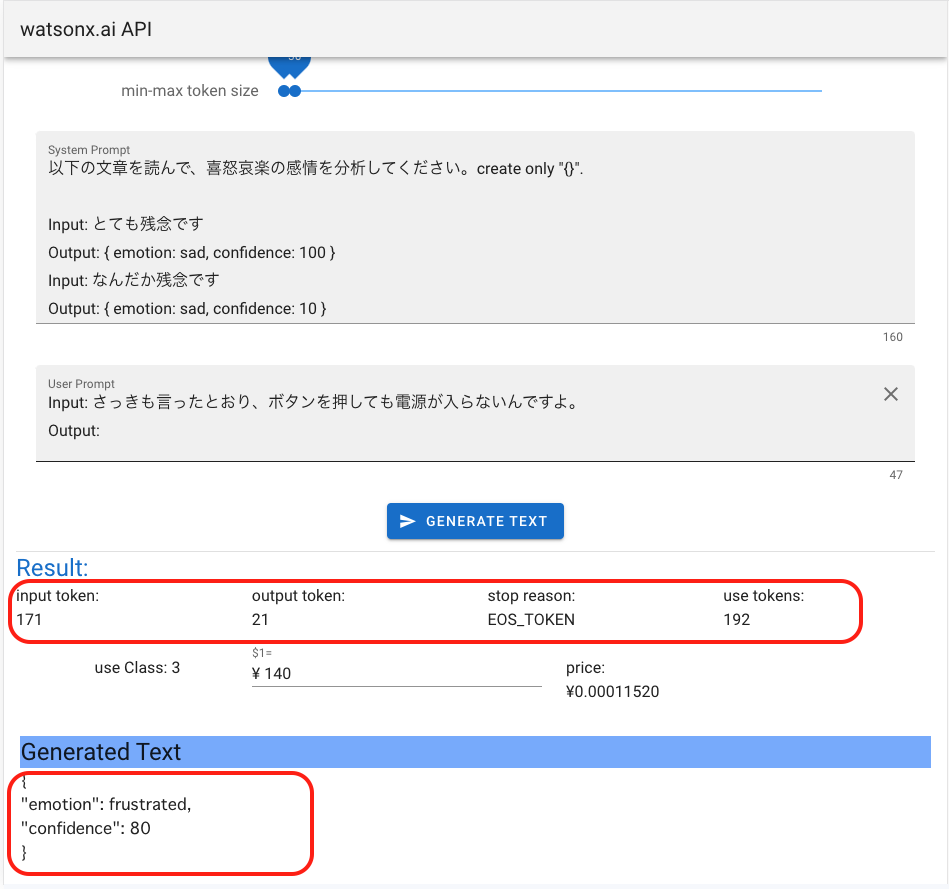

# watsonx .ai Build Assets

## watsonx に登録
* [サービスのマニュアルはこちら](https://dataplatform.cloud.ibm.com/docs/content/wsj/getting-started/signup-wx.html?context=wx&audience=wdp)
  <div>
    
    
  </div>
* 登録完了
  <div>
    
  </div>

## プロジェクト設定
* "新規プロジェクトの作成" を押す
  <div>
    
  </div>
* ICOSのサービスが必要(ライトプラン可)
  <div>
    
  </div>
* [管理]タブの "プロジェクトID" をコピーしておく
  <div>
    
  </div>
* "プロンプト・ラボ" を押す
  <div>
    
  </div>
* 他サービスの関連付けを設定する
  * MachineLearning, WatsonStudio のライトプランを作成して設定する
  <div>
    
    
  </div>
* "サンプル・プロンプト" を何か選んで[生成]を押し、動作することを確認する
  <div>
    
  </div>
* [参考] RESTAPI用のサンプルコードを確認する
  <div>
    
    
  </div>
  <div>
    
  </div>

## リソース使用率を確認
  * プロジェクトの [概要]タブを表示する
  * 生成に使用したトークン数が表示される
    <div>
      
    </div>
  * 無料枠は50000トークン(2023/9/27現在)
    <div>
      
    </div>

## API Keyを作成
* [IBM Cloudの画面でAPIキーを作成](https://cloud.ibm.com/docs/account?topic=account-manapikey&interface=ui)
  <div>
    
    
  </div>
* APIKeyをコピーしておく
  <div>
    
  </div>

## 使用しているJavaScriptライブラリ
* [Vue.js](https://jp.vuejs.org/v2/guide/) 2系
* [Vuetify](https://vuetifyjs.com/ja/getting-started/installation/)

## 開発ツールのインストール
* [Node.jsとnvmのインストール](https://kazuhira-r.hatenablog.com/entry/2021/03/22/223042)
  * "node -v", "npm -v" コマンドを確認

## プロジェクトのセットアップ
### ソースのダウンロード
* Gitからソース一式をクローン、or zipファイルダウンロード
```
 "wx_bridge_api.zip" ファイルを展開
```

### プロジェクトのファイルをインストール
* 展開したソースのディレクトリに "cd"してからインストールを実行
```
"cd ./wx_bridge_api"
npm install
```
* "package.json"ファイルのあるフォルダ内で上記を実行
* "package.json" 記載のモジュールが "node_modules"配下に展開される

## 開発手順
### watsonxとIBMCloudのサービス情報をセットする
  * 展開したフォルダ内で ".env_sample"ファイルを ".env"ファイルにコピーする
  * 作成した"プロジェクトID"と"APIキー"を貼り付ける
    * WX_KEY, WX_PRJID

### watsonx.aiサービスとの中継サーバを起動しコンテンツの動作を確認
```
node server.js
```
* 起動成功で "http://localhost:3000/index.html" でローカルサーバのコンテンツが表示される
* 起動時にIBMCloud認証を行うので情報が表示されていることを確認
  <div>
    
  </div>
* 生成を実行
  <div>
    
  </div>

## 参考
[APIマニュアル](https://test.cloud.ibm.com/apidocs/watsonx-ai)
