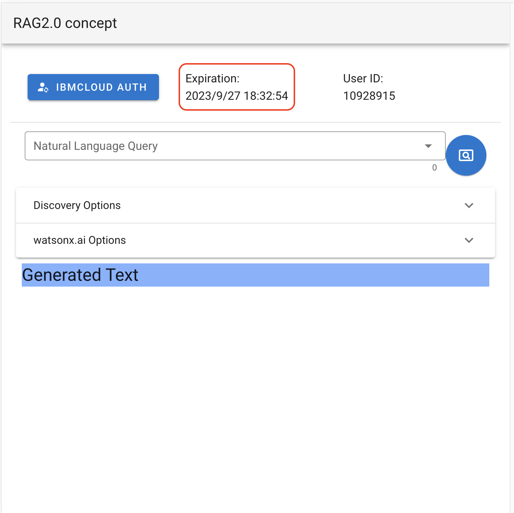
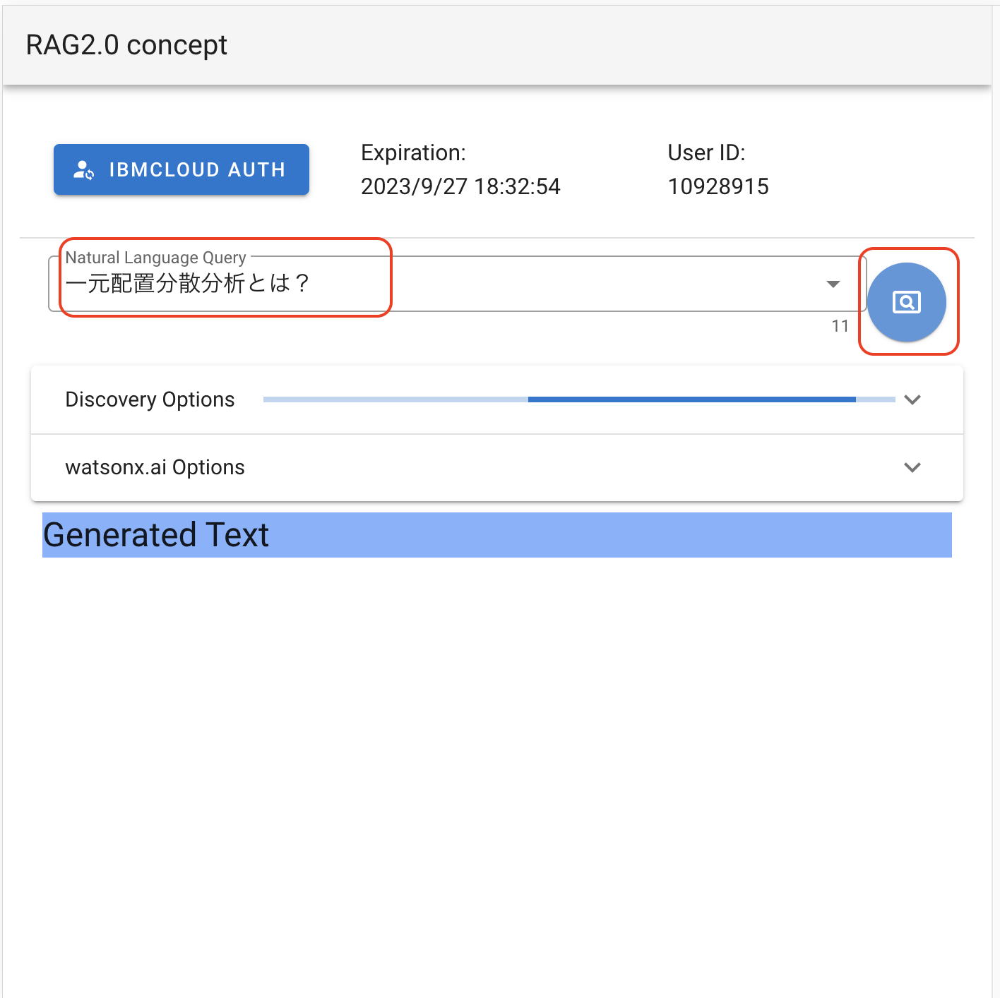
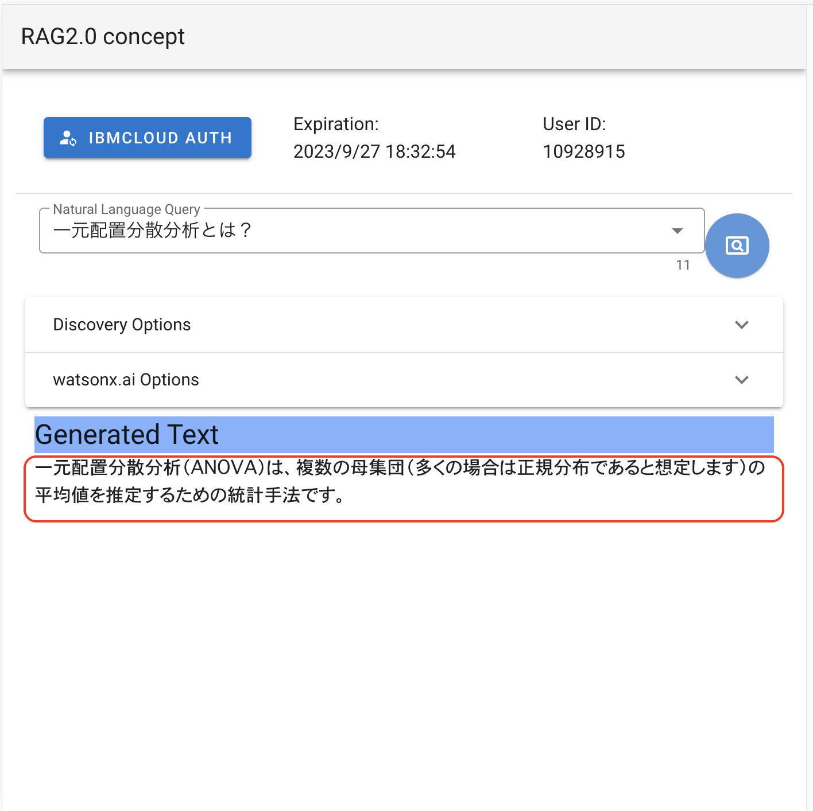
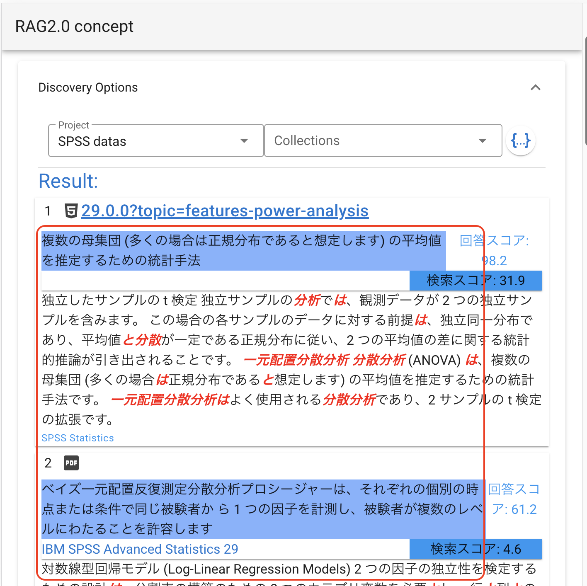
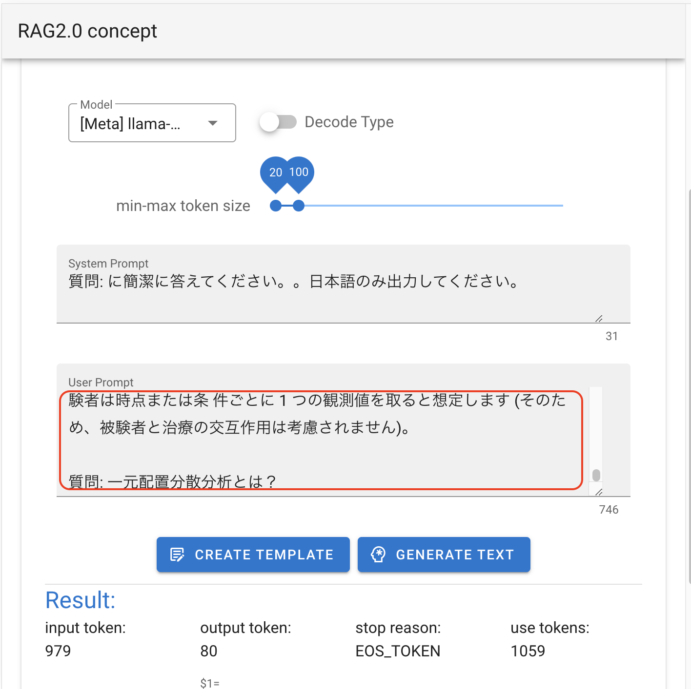

# watsonx .ai & Watson Discovery Build Assets

## 前提条件
* [wd_bridge_api](https://github.com/iymh/wd_bridge_api), [wx_bridge_api](https://github.com/iymh/watsonx/tree/main/wx_bridge_api) の環境構築ができている

## 使用しているJavaScriptライブラリ
* [Vue.js](https://jp.vuejs.org/v2/guide/) 2系
* [Vuetify](https://vuetifyjs.com/ja/getting-started/installation/)

## 開発ツールのインストール
* [Node.jsとnvmのインストール](https://kazuhira-r.hatenablog.com/entry/2021/03/22/223042)
  * "node -v", "npm -v" コマンドを確認

## プロジェクトのセットアップ
### ソースのダウンロード
* Gitからソース一式をクローン、or zipファイルダウンドード
```
 "wxwd_bridge_api.zip" ファイルを展開
```

### プロジェクトのファイルをインストール
* 展開したソースのディレクトリに "cd"してからインストールを実行
```
"cd ./wxwd_bridge_api"
npm install
```
* "package.json"ファイルのあるフォルダ内で上記を実行
* "package.json" 記載のモジュールが "node_modules"配下に展開される

## 開発手順
### watsonxとIBMCloudのサービス情報をセットする
  * 展開したフォルダ内で ".env_sample"ファイルを ".env"ファイルにコピーする
  * 作成した"プロジェクトID"と"APIキー"を貼り付ける
    * WD_BASE_URL, WD_KEY, WX_KEY, WX_PRJID

### watsonx.ai　& WatsonDiscovery サービスとの中継サーバを起動しコンテンツの動作を確認
```
node server.js
```
* 起動成功で "http://localhost:3000/index.html" でローカルサーバのコンテンツが表示される
* 起動時にIBMCloud認証を行うので情報が表示されていることを確認
  <div>
    
  </div>
* 質問文を入力して、検索を実行
  <div>
    
  </div>
* 要約された一文の回答が表示されることを確認する
  <div>
    
  </div>
* WatsonDiscoveryの検索結果を確認する
  * 回答のconfidenceが0.5以上の回答を使用する
  <div>
    
  </div>
* watsonx.aiに渡すプロンプトを確認する
  * discoveryの検索結果から answer, passageを切り出し整形する
  * 質問文と合わせて回答の絞り込みを行う
  <div>
    
  </div>

